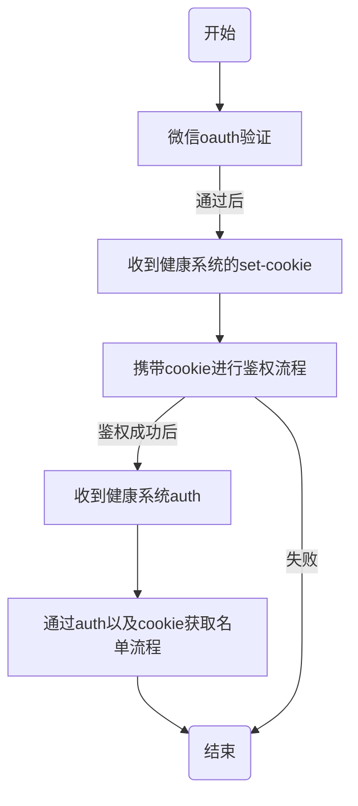
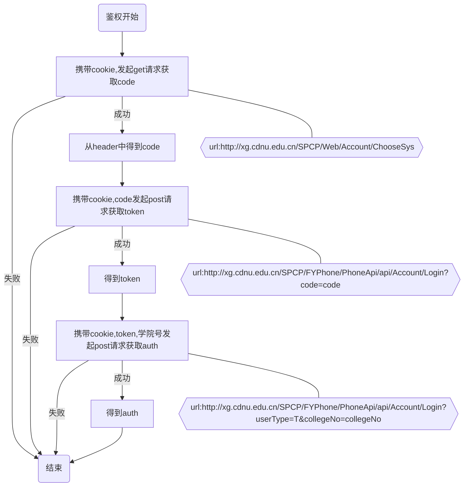
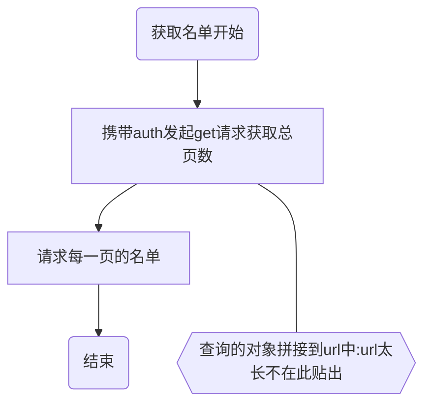

## 校园助手机器人插件

### 项目简介

疫情防控,qq群自动催签到.信息推送,一人管理多群，多群信息综合到一起，At全体成员信息自动转发。

### 项目介绍

#### 技术栈

* [mirai机器人](https://github.com/mamoe/mirai)
* okhttp发送网络请求
* java基础
* quartz定时任务
* redis缓存服务

### 使用方法

1.  催签到功能(详细介绍回复“催签到介绍”)： 

- - 群里发送："催签到"
  - 群里发送：@bot"登录"

2. 信息推送功能(详细介绍回复“信息推送介绍”): 

- - 群里或者私聊发送:"添加推送好友:好友qq号"
  - 群里或者私聊发送:"删除推送好友:好友qq号"
  - 群里或者私聊发送:"添加推送子群:qq群号"
  - 群里或者私聊发送:"删除推送子群:qq群号"
  - 群里或者私聊发送:"查看推送目标"
  - 群里或者私聊发送:"开始推送"
  - 群里或者私聊发送:"结束推送"
  - 群里@全体成员自动推送

3.  查看使用方法: 

- - 群里或者私聊发送:"使用方法",或者直接戳一戳机器人

4.  动态开启以上功能(仅限机器人master) 

- - 开启/关闭催签到功能
  - 开启/关闭自动催签到
  - 开启/关闭登录
  - 开启/关闭加好友
  - 开启/关闭加群
  - 开启/关闭信息推送

5. 机器人管理命令(仅限机器人master):

- - 查看状态命令:/status
  - 查看文件夹命令:/查看文件夹  文件夹
  - 查看文件内容命令:/查看文件 文件夹 文件
  - 删除文件夹命令:/删除文件夹 文件
  - 删除文件命令:/删除文件 文件夹 文件
  - 通知命令:/通知 通知内容

### 两大功能详细介绍

#### 催签到功能介绍

##### 面向用户

成都师范学院(暂时未适配其他学校)

##### 模块

1. 手动催签到模块:

- - 在群里发送"催签到",机器人将会@未签到的同学，@信息将会在90分钟后自动撤回

1. 自动催签到模块:

- - 机器人将在每天的9.00,11.00,12.00,13.00,14.00,15.00自动@未签到同学

1. 登录模块 :

- - 在群里@机器人并回复登录进行登录，登录成功后才可进行催签到，当多人同时进行登录时，可能需要进行排队等待，根据提示操作即可。

##### 使用方法

1.  联系我(1597081640)，提供您的学院，专业信息，以及辅导员健康系统的账号和密码 
2.  等待我添加配置文件后，将机器人拉入学院或班级或专业群 
3.  @机器人"登录",进行首次登录 
4.  登录完成后即可使用 

- 注:目前仅适配成都师范学院

#### 信息推送功能介绍

##### 面向用户

社团部门负责人，辅导员，班委，干事，希望对多个群信息进行整合的同学

##### 使用情景

1. 当你需要发送通知时，你是否因为要通知多个群，而进行重复的复制粘贴，使用信息推送功能，你只需向机器人发送一次通知，机器人便可以将通知信息发给你需要通知的所有群，具体操作请看以下动图


1. 你是否因为通知群太多时常置顶十几个群？使用信息推送功能，机器人将会把各通知群里的信息合并推送给你(这需要构建一个生态)，你只需要查看机器人给你发送的信息即可！具体操作请看以下动图


1. 将专业群里配置班级小群@全体同学的重要信息自动推送到配置的班级小群

##### 使用方法(建议先了解下面的几个名词)

1. 先确定你要以怎样的形式进行信息推送，在群里进行信息推送？或者私聊机器人进行信息推送
2. 设置推送对象，群里或者私聊发送：“添加推送子群:qq群号”，“添加推送好友:好友qq号”
3. 群里或者私聊发送：“开始推送”，开启信息推送
4. 群里或者私聊发送“结束推送”，结束信息推送
5. 一旦在群里配置了推送目标，@全体成员的信息就会自动推送到推送目标
6. 如果需要删除子群或者推送好友私聊发送：“删除推送子群:qq群号”来删除子群;“删除推送好友:好友qq号”来删除推送好友

##### 补充基础名词

信息源,待推送信息，推送目标

1.  信息源:指待推送信息的来源，可以为一个群，和个人。当你在群里进行信息推送时，信息源就是该群，当你在打开和机器人的聊天窗口进行信息推送时，信息源就是你本人。 
2.  待推送信息:支持普通文本，图片，文件(目前仅支持群->群),语音(目前仅支持本人->好友，群->群) 
3.  推送目标：群和好友 

- 注:信息源和推送目标是通过机器人联系起来的，将待推送信息从群->群，群->好友，本人->好友。所以需要邀请机器人进入群，加机器人为好友。希望你我一起构建信息推送的生态

### 项目运行
> 项目运行前需要配置一些参数，首先请确保你的本地电脑或者云服务器有redis，插件某些功能使用到了redis,如果没有请先安装redis。

#### <span id="jump">插件配置介绍 </span>
* base目录
  * PluginConfig.properties
    > 整个插件的基础配置，插件加载后将会读取该配置文件，将所配置的内容实例化到MyPluginConfig类中，供插件使用，某些配置可启动项目后动态开启
    ```properties
    #本校催签到需要使用，是否开启登录功能，不设置默认值为false
    isLogin=true
    #本校催签到需要使用，若未配置登录功能不能正常使用
    baseCookie=ASP.NET_SessionId=xxxxxxxxx
    #本校催签到需要使用，是否定时自动催签到，不设置默认值为false
    isAutoSign=true
    #机器人主人qq设置，用于事件中出现未捕获异常发送信息给master，以及判断某些事件是否是主人再操作，默认为我的qq
    master=1597081640
    #本校催签到需要使用，是否开启手动催签到，不设置默认值为false
    isSign=true
    #是否开启信息推送功能，不设置默认值为false
    isPushMsg=true
    #是否自动同意好友请求，不设置默认值为false
    agreeAddFriend=false
    #是否自动同意加群请求，不设置默认值为false
    agreeAddGroup=false

  * redis.properties
    >redis连接池的配置文件
    ```properties
    #总连接数
    redis.max.total=5
    #最大空闲连接数
    redis.max.idle=5
    #最小空闲连接数
    redis.min.idle=0
    #redis服务的ip
    redis.ip=127.0.0.1
    #redis服务的端口
    redis.port=6379
    #redis验证的用户名
    redis.username=root
    #redis验证的密码
    redis.password=root
* group目录
  >该目录会在插件加载时自动创建，无需自己建立。(仅限成都师范学院才能使用)若需要催签到则需要新建文件qq群.properties
  * group目录下的push目录下的信息推送配置文件
  
    >该目录下的配置文件仍然不用手动配置。开启信息推送功能后，在需要监听信息的主群中发送:"添加子群:群号"即可自动创建该群配置文件
    ````yaml
    childGroupId: ['786986736', '820315251'] #子群
    groupId: '979598451'#主群
    num: 2 #总子群数

#### 在idea中测试运行

1. 在src下新建test.kotlin包,在包下建立一个kotlin主函数,填写账号密码，例如
```kotlin
suspend fun main() {
    MiraiConsoleTerminalLoader.startAsDaemon()

    val pluginInstance = Plugin.INSTANCE

    pluginInstance.load() // 主动加载插件, Console 会调用 Plugin.onLoad
    pluginInstance.enable() // 主动启用插件, Console 会调用 Plugin.onEnable

    MiraiConsole.addBot(12456, "").alsoLogin() // 登录一个测试环境的 Bot，填写自己的qq号和密码

    MiraiConsole.job.join()
}
```
2. 在项目目录新建立base文件夹，在base文件夹中新建立pluginConfig.properties
   与redis.properties，配置内容见**[插件配置介绍](#jump)**

#### 以插件方式使用
1. 下载本插件jar包。
2. 使用mirai控制台或者mirai图形化界面添加插件jar包。具体操作看[Mirai用户手册](https://github.com/mamoe/mirai/blob/dev/docs/UserManual.md)
3. 项目目录新建立base文件夹，在base文件夹中新建立pluginConfig.properties
   与redis.properties，配置内容见**[插件配置介绍](#jump)**
4. 运行项目
### 项目文档

#### 健康打卡系统登录查询未签到名单流程分析

##### 总流程图



##### 鉴权流程图



##### 获取名单流程图



##### 登录流程图

todo

#### 项目结构分析

##### 项目流程图

todo

##### bean包

* MyGroup
* QueryObject
* QueryAccount

##### simulation包：用于统一发送模拟请求的包

* SimulationRequest

  对上述流程图进行模拟请求，核心类，详细内容请看代码注释

##### dao包:对文件进行io操作的包

* GroupDao

  将group文件夹下的文件进行操作，将每一个配置文件封装到java的MyGroup对象中

* QueryAccountDao

  将college文件夹下的文件进行操作，将每一个配置文件封装到java的QueryAccount对象中

##### service包：业务逻辑

* SignService

  催签到逻辑的主要实现类

* LoginService

  登录逻辑的主要实现类

##### exception包：项目自定义的异常

* AuthIsNullException

  验证过程中返回的验证为空异常，表明cookie失效

* GroupFileNotFindException

  群配置文件没有找到异常

* QueryAccountFileNotFindException

  查询账户文件未找到异常

##### job包:定时任务

* AutoSignJob

  每日自动催签到

##### util包:封装的一些工具

##### commond包:自定义的命令

### 最后

代码写的烂，大佬勿喷