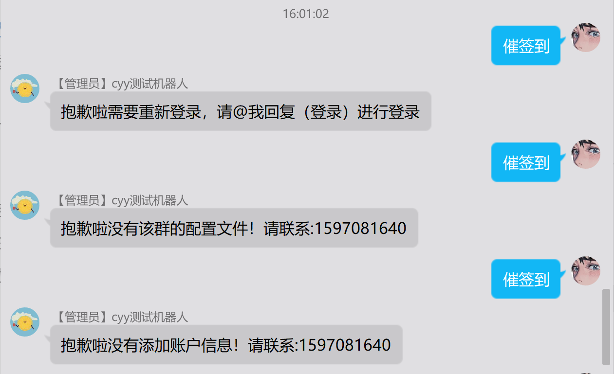
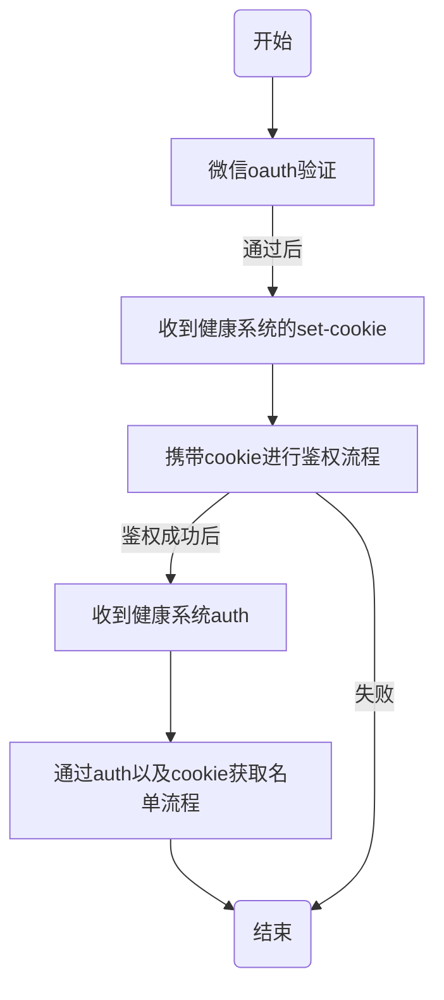
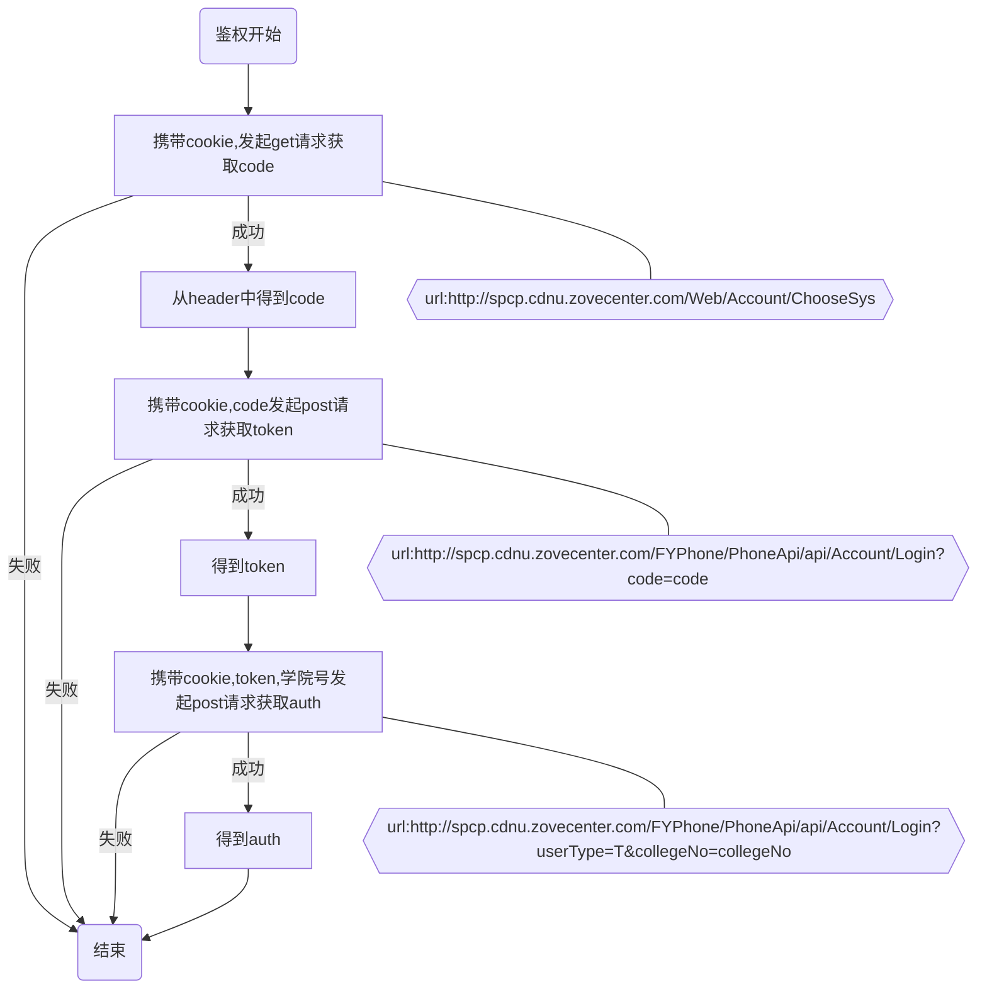
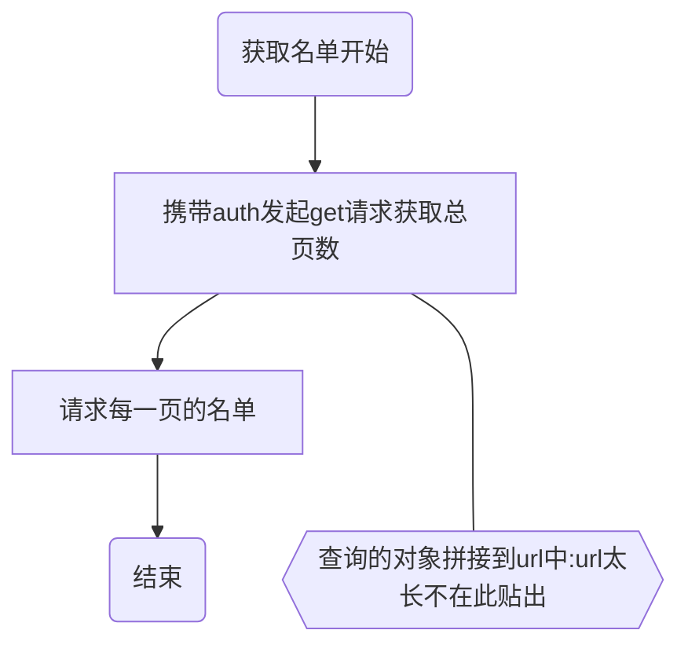

## 校园助手机器人插件

### 项目简介

由于疫情防控，学校安排每日打卡，所以每日监督打卡就成了一个问题，查询后台数据并对未签到的同学进行提醒，在班级群里手动@，如果人数少还好，人数一多就呵呵了。所以项目通过mirai机器人，模拟查询后台未签到同学的数据进行通知。

### 项目介绍

#### 技术栈

* [mirai机器人](https://github.com/mamoe/mirai)
* okhttp发送网络请求
* java基础
* quartz定时任务
* redis缓存服务

#### 具体功能
> 催签到功能具有学校局限性，你可以分析我的代码自己适配你的学校
* 通过qq会话向健康打卡系统模拟登录
* 每日定时在qq群中@未签到同学
* qq群中手动发送指令@未签到同学
* at全体成员信息自动推送到子群
* 批量推送信息到子群
* 自动同意添加好友
* 自动同意邀请入群
#### 项目效果图

* 签到功能相关(由于是测试群，所以显示at失败)
  

* 登录功能相关

  

* 异常处理相关

  
* 推送信息相关

### 项目运行
> 项目运行前需要配置一些参数，首先请确保你的本地电脑或者云服务器有redis，插件某些功能使用到了redis,如果没有请先安装redis。

#### <span id="jump">插件配置介绍 </span>
* base目录
  * PluginConfig.properties
    > 整个插件的基础配置，插件加载后将会读取该配置文件，将所配置的内容实例化到MyPluginConfig类中，供插件使用，某些配置可启动项目后动态开启
    ```properties
    #本校催签到需要使用，是否开启登录功能，不设置默认值为false
    isLogin=true
    #本校催签到需要使用，若未配置登录功能不能正常使用
    baseCookie=ASP.NET_SessionId=xxxxxxxxx
    #本校催签到需要使用，是否定时自动催签到，不设置默认值为false
    isAutoSign=true
    #机器人主人qq设置，用于事件中出现未捕获异常发送信息给master，以及判断某些事件是否是主人再操作，默认为我的qq
    master=1597081640
    #本校催签到需要使用，是否开启手动催签到，不设置默认值为false
    isSign=true
    #是否开启信息推送功能，不设置默认值为false
    isPushMsg=true
    #是否自动同意好友请求，不设置默认值为false
    agreeAddFriend=false
    #是否自动同意加群请求，不设置默认值为false
    agreeAddGroup=false

  * redis.properties
    >redis连接池的配置文件
    ```properties
    #总连接数
    redis.max.total=5
    #最大空闲连接数
    redis.max.idle=5
    #最小空闲连接数
    redis.min.idle=0
    #redis服务的ip
    redis.ip=127.0.0.1
    #redis服务的端口
    redis.port=6379
    #redis验证的用户名
    redis.username=root
    #redis验证的密码
    redis.password=root
* group目录
  >该目录会在插件加载时自动创建，无需自己建立。(仅限成都师范学院才能使用)若需要催签到则需要新建文件qq群.properties
  * group目录下的push目录下的信息推送配置文件
  
    >该目录下的配置文件仍然不用手动配置。开启信息推送功能后，在需要监听信息的主群中发送:"添加子群:群号"即可自动创建该群配置文件
    ````yaml
    childGroupId: ['786986736', '820315251'] #子群
    groupId: '979598451'#主群
    num: 2 #总子群数

#### 在idea中测试运行

1. 在src下新建test.kotlin包,在包下建立一个kotlin主函数,填写账号密码，例如
```kotlin
suspend fun main() {
    MiraiConsoleTerminalLoader.startAsDaemon()

    val pluginInstance = Plugin.INSTANCE

    pluginInstance.load() // 主动加载插件, Console 会调用 Plugin.onLoad
    pluginInstance.enable() // 主动启用插件, Console 会调用 Plugin.onEnable

    MiraiConsole.addBot(12456, "").alsoLogin() // 登录一个测试环境的 Bot，填写自己的qq号和密码

    MiraiConsole.job.join()
}
```
2. 在项目目录新建立base文件夹，在base文件夹中新建立pluginConfig.properties
   与redis.properties，配置内容见**[插件配置介绍](#jump)**
  
#### 以插件方式使用
1. 下载本插件jar包。
2. 使用mirai控制台或者mirai图形化界面添加插件jar包。具体操作看[Mirai用户手册](https://github.com/mamoe/mirai/blob/dev/docs/UserManual.md)
3. 项目目录新建立base文件夹，在base文件夹中新建立pluginConfig.properties
   与redis.properties，配置内容见**[插件配置介绍](#jump)**
4. 运行项目
### 项目文档

#### 健康打卡系统登录查询未签到名单流程分析

##### 总流程图



##### 鉴权流程图



##### 获取名单流程图



##### 登录流程图

todo

#### 项目结构分析

##### 项目流程图

todo

##### bean包

* MyGroup
* QueryObject
* QueryAccount

##### simulation包：用于统一发送模拟请求的包

* SimulationRequest

  对上述流程图进行模拟请求，核心类，详细内容请看代码注释

##### dao包:对文件进行io操作的包

* GroupDao

  将group文件夹下的文件进行操作，将每一个配置文件封装到java的MyGroup对象中

* QueryAccountDao

  将college文件夹下的文件进行操作，将每一个配置文件封装到java的QueryAccount对象中

##### service包：业务逻辑

* SignService

  催签到逻辑的主要实现类

* LoginService

  登录逻辑的主要实现类

##### exception包：项目自定义的异常

* AuthIsNullException

  验证过程中返回的验证为空异常，表明cookie失效

* GroupFileNotFindException

  群配置文件没有找到异常

* QueryAccountFileNotFindException

  查询账户文件未找到异常

##### job包:定时任务

* AutoSignJob

  每日自动催签到

##### util包:封装的一些工具

##### commond包:自定义的命令

### 最后

代码写的烂，大佬勿喷